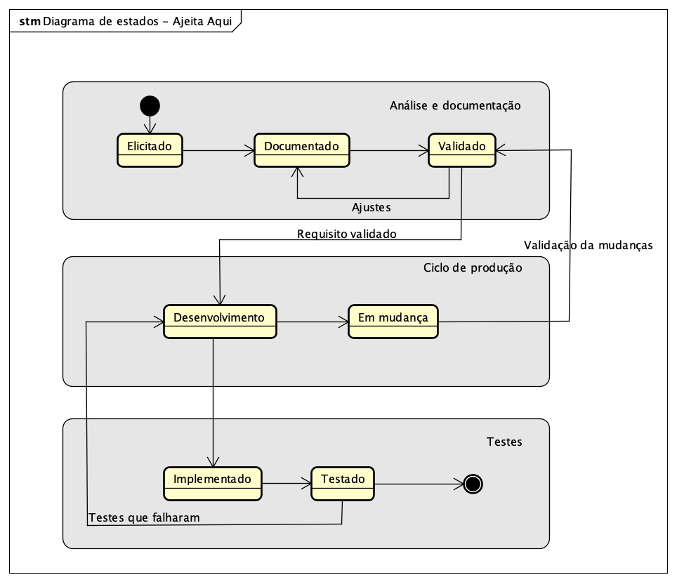

# Estado Atual dos Requisitos – Projeto Ajeita Aqui
## Diagrama de Estados

---

## Estado Atual dos Requisitos
| Código  | Nome                                     | Estado Atual   |
|---------|------------------------------------------|----------------|
| RF01    | Gerenciar categorias e serviços          | Testado       |
| RF02    | Gerenciar profissionais                  | Testado       |
| RF03    | Gerenciar usuários                       | Testado   |
| RF04    | Pesquisar profissionais                  | Testado       |
| RF05    | Gerenciar planos de profissionais        | Validado       |
| RF06    | Apresentar profissionais melhor avaliados| Em Elicitado     |
| RF07    | Favoritar profissional                   | Validado   |
| RF08    | Avaliar serviço                          | Validado       |
| RF09    | Gerenciar portfólio                      | Aprovado       |
| RF10    | Sistema de mensagens (Chat)              | Em Validado     |
| RNF01   | Arquitetura Modular                      | Validado       |
| RNF02   | Logging e Tratamento de Erros            | Testado   |
| RNF03   | Documentação da API com Swagger          | Testado       |

